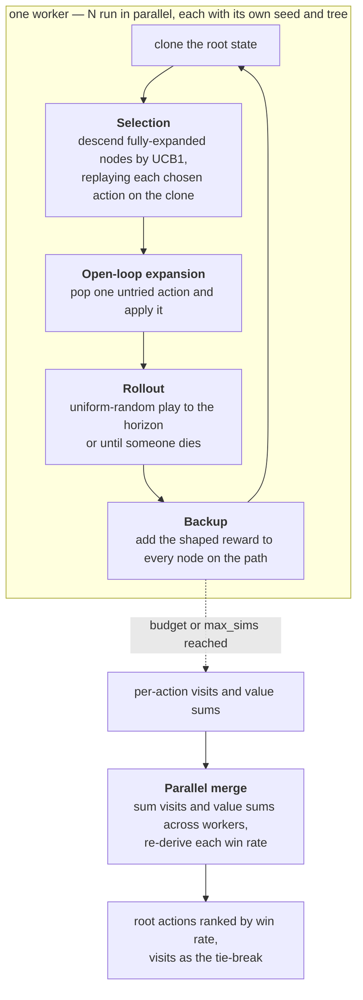

# mcts-combat-engine

[](https://github.com/T92T1914/mcts-combat-engine/actions/workflows/ci.yml)


A Monte Carlo Tree Search engine for stochastic, imperfect-information,
turn-based combat — pure Python, zero dependencies, with a toy card-duel
game to prove it plays well.

Extracted and generalized from a larger private project — a decision-support
engine for a complex turn-based strategy game, where this search core
(compiled with mypyc and fanned out across cores) evaluated 400,000+
simulations per decision inside a one-second budget. This repo is the
algorithmic core of that system with an original, self-contained example
game, so every claim here is runnable and testable on any machine with
Python 3.11+.

**In one screen**

- **Open-loop tree.** Nodes hold action sequences, not states; every
  simulation replays its path under fresh randomness, so a node's value is
  an average over the outcome distribution. No chance nodes.
- **Root-parallel.** N processes search independently and the parent sums
  their per-action statistics. Zero shared state, exact merge.
- **Reward shaping that came from watching it play.** Wins discounted by
  depth; late losses worth slightly more than early ones. Both documented,
  neither swept.
- **Content is data.** Cards, encounters and boss mechanics are validated
  JSON; the engine never reads a file.
- **Measured, with error bars.** Seed-paired benchmark against random and
  greedy baselines, Wilson intervals and z-scores computed by code, machine
  recorded.

## Why open-loop MCTS

Classic MCTS stores a game state in every tree node. That breaks down when
the game is stochastic: accuracy rolls, resource regeneration, and enemy
behavior mean one action sequence leads to many possible states, and
state-per-node search needs explicit chance nodes for every die roll.

The open-loop variant stores only **action sequences** in the tree. Every
simulation replays its path from the root under fresh randomness, so a
node's value automatically averages over the whole outcome distribution —
which is exactly what "win probability of this move" means. The trade-off
(re-simulating from the root every time) is paid back by much smaller trees
and no chance-node bookkeeping.

Two reward-shaping details in `engine/mcts.py` came directly from watching
the engine play badly, and are the difference between "correct" and "plays
like a human":

- **Wins are discounted by depth** (4.5%/round). Without it, "kill in 3
  rounds" and "chip away for 6" score within noise of each other and the
  engine looks indifferent to finishing fights.
- **Losses are worth more the later they come** (up to 0.15). With a flat
  0.0 for every loss, healing at 5% win probability scores the same as
  dying immediately — the engine was blind to survival. This term makes it
  heal, shield, and play for time when behind, without ever preferring a
  slow loss to any win.

## How one decision is made



Because the tree stores actions, an action minted in one realization can be
stale in another (the hand did not shrink because the player died earlier
here); the simulator degrades it to a pass rather than crashing. A rollout
that reaches the horizon alive is scored by an HP heuristic that credits
setup — a trap on an enemy or a blade on the player counts as progress —
so "trap now, one-shot next round" is not invisible to a shallow search.
Terminal rollouts get the shaped reward above.

## What's in the box

```
engine/            the search engine (game-agnostic; pip-installable)
  state.py         combatants, cards, charms, DoTs; fast manual clone()
  actions.py       legal-move enumeration
  simulator.py     one stochastic round: cast -> enemy policies -> upkeep
  rules.py         pluggable boss mechanics ("punish traps", "enrage")
  mcts.py          open-loop UCB1 search with priors support
  parallel.py      root-parallel search: N processes, merged statistics
game/              the example game (content, not engine)
  loader.py        JSON -> validated Card/Combatant/rule objects
  content.py       loads data/ at import; exposes CARDS and SCENARIOS
  baselines.py     random and greedy policies to beat
  runner.py        seed-paired match harness
  stats.py         Wilson intervals and z-scores behind the results table
data/
  cards.json       the 9-card elemental deck
  scenarios.json   three encounters, incl. the boss and its rules
docs/
  design-decisions.md   each design choice: why, what lost, where in code
  benchmark-results.md  the table below, as benchmark.py wrote it
demo.py            watch one decision with ranked moves
benchmark.py       the table below, with intervals and provenance
tests/             47 tests: mechanics, search sanity, parallel merge,
                   loader validation, statistics, beats-the-baselines
```

`engine/` never imports `game/`. The engine consumes plain `Card` and
`Combatant` objects and knows nothing about JSON, decks, or scenarios.

## Data-driven content

The engine never reads a data file — it consumes plain `Card`/`Combatant`
objects. All example content lives in `data/*.json`, parsed by
`game/loader.py`, which validates loudly at load time: unknown elements,
malformed cards, deck references to missing cards, out-of-range stats, and
unknown boss-rule types all fail with a message naming the offending entry.
Boss mechanics are data too — a registry maps rule names in
`scenarios.json` to `BossRule` classes, so `{"type": "punish_traps",
"damage": 350}` builds the same object code would. Adding a card or an
encounter means editing JSON; adding a new *mechanic* means one `BossRule`
subclass plus a registry entry. This mirrors the parent project's
architecture, where a knowledge base of thousands of cards and encounters
fed the same generic engine.

A parity test pins the shipped JSON to the exact RNG stream the benchmark
was measured with, so content edits can't silently invalidate the numbers
below.

## Results

Sixty games per policy per scenario, identical game seeds for every policy
(differences are policy, not luck). `greedy` always throws the biggest
affordable hit at the best target — the strongest "obvious" strategy. The
search runs in a single process, so these numbers describe one core.

Measured 2026-09-05 on an AMD Ryzen 7 7800X3D (8 cores / 16 threads, 64 GB
RAM, Windows 11 Pro) under Python 3.11.8, in 7.1 minutes. The table is
[`docs/benchmark-results.md`](docs/benchmark-results.md) exactly as
`benchmark.py --markdown` wrote it.

| scenario | random | greedy | mcts (120 ms) | search vs best baseline |
|---|---|---|---|---|
| duel | 90% (80–95) · 20.2r | 35% (24–48) · 16.2r | **100% (94–100) · 16.6r** | z = 2.51 vs random |
| gauntlet | 55% (42–67) · 23.4r | 32% (21–44) · 17.2r | **95% (86–98) · 16.9r** | z = 5.06 vs random |
| boss | 20% (12–32) · 25.9r | 3% (1–11) · 17.0r | **57% (44–68) · 22.4r** | z = 4.13 vs random |

*win % = clean wins (95% Wilson interval) · Nr = average rounds to win, when it won · bold = best in row*

`duel` is 1v1 against a resistant enemy, `gauntlet` 1v3 against weaker
attackers, `boss` an elite encounter with enrage and trap punishment.

Two things worth noticing:

- **Greedy loses to random on the duel.** Random occasionally heals and
  shields by accident; greedy never does. In a game where survival funds
  future damage, never healing is worse than playing randomly — the
  clearest possible demonstration that "deal max damage now" is a trap.
- **The boss is tuned to be genuinely hard** (enrages below half HP,
  punishes traps). Search wins 57% where the best naive policy manages
  20% — it learns to blade before it hits, race the enrage timer, and
  spend pips on heals only when the math demands it. Greedy's 3% is what
  "hit hardest every turn" is actually worth against a boss with a clock.

## What these numbers do not prove

- **Sixty games per cell is not many.** The 95% Wilson intervals are wide:
  the boss row's 57% is 44-68%, random's 20% is 12-32%. The gap between
  them is still decisive (two-proportion z = 4.13), and so is greedy's
  collapse. The duel row is thinner than a bolded 100% suggests: z = 2.51
  against random's 90%, and a second run of the same benchmark minutes
  earlier on the same machine landed at 97% (z = 1.46, short of
  significance at the 95% level). Seed-pairing removes luck *between*
  policies, not the sampling error in each.
- **The search column moves between runs; the baselines do not.** Random
  and greedy are fully determined by the game seeds, so their cells
  reproduce exactly. The search is stopped by a wall clock, so its
  simulation count per decision depends on the machine and the moment;
  two runs here scored 97 / 92 / 53% and 100 / 95 / 57% on the three rows.
  For an exactly reproducible search, pin the simulation count, as the
  tests and `demo.py --sims` do.
- **One game does not establish generality.** `engine/` never imports
  `game/`, and the split is real, but "game-agnostic" is an architectural
  claim demonstrated on a single 9-card domain. A second, structurally
  different game would test it; this repo has not run that test.
- **Greedy is the strongest baseline here, and it is not strong.** It never
  heals, which the duel row shows is a fatal flaw. Beating it is necessary,
  not sufficient - a hand-tuned heuristic that knew when to shield would be
  the honest next opponent.
- **The constants were tuned by watching, not swept.** The 4.5% per-round
  win discount and the 0.15 late-loss term came from observing bad play and
  fixing it, which is how they are described above; the UCB1 exploration
  constant (1.2) is likewise a hand-chosen value. None has a sensitivity
  analysis, so "4.5%" should be read as "a small discount that worked", not
  as an optimum.
- **The parallel engine's speedup is not measured here.** Its merge is
  unit-tested and a two-worker pool round-trip is tested, but the benchmark
  and the demo both use the single-process search.

## Run it

No install is needed; everything runs from a checkout on Python 3.11+.

```
python demo.py boss                  # one decision, ranked moves, sims/sec
python demo.py boss --sims 10000     # the same table on every machine
python benchmark.py                  # the table above (several minutes)
python benchmark.py --markdown docs/benchmark-results.md --machine "your CPU"
python -m unittest discover -s tests # ~4 min: includes search-vs-baseline matches
```

The engine alone is pip-installable (`pip install .`, zero runtime
dependencies); `game/`, `data/` and the two scripts are the worked example
and stay in the checkout. Development checks, which CI runs on every push:

```
pip install ruff mypy
ruff check .                         # E, W, F, I, B; rules in pyproject.toml
mypy                                 # engine/, game/, both scripts
```

## Reading one decision

`demo.py boss --sims 10000` prints one decision. The simulation count and
the search seed are pinned, so the table is the same on every machine (this
one was checked on Python 3.11 and 3.13); only the timing line changes.

```
Scenario: boss
You: Player  HP 3000/3000  pips 0+0p
  vs Frost Tyrant [boss]  HP 3000/3000
Hand: Ember Blade, Fire Blast, Weakness Mark, Spark, Flame Dart, Mend, Flame Dart
  rule: Boss hits back for 350 whenever the player casts a trap
  rule: Under 50% HP the boss gains a +25% blade each round

10,000 simulations in 574 ms (17,420/s)

move                                win%    visits
Spark -> Frost Tyrant             51.0%     5,150
Pass                              49.3%     2,904
Weakness Mark -> Frost Tyrant     47.8%     1,946

Recommended: Spark -> Frost Tyrant
```

The ordering is the interesting part. **Weakness Mark is rated below doing
nothing at all** — it is a trap, and this boss hits back for 350 whenever a
trap is cast, so the debuff costs more than it gains. Nothing told the search
that; it is `rules.py` applied inside the rollouts and priced by the outcome.
The visit counts show where the budget went: 5,150 of 10,000 simulations on
the move it ended up recommending, which is what a converged UCB1 search
looks like when one option is genuinely ahead but not by much.

## Performance notes

Pure Python does roughly 13,000-22,000 simulations/second on one core here
(boss scenario, Python 3.11 and 3.13, across several runs on the machine
described above). The parent project needed hundreds of thousands per
decision inside a sub-second budget; that gap closed with two orthogonal
steps, both reflected in this codebase's design:

- **mypyc compilation** (~4-5x/core). The annotations in `engine/` — typed
  containers, `Optional` on nullable node fields, `__reduce__` on the
  frozen dataclass — are what made the engine compile cleanly. Untyped
  containers alone cost most of the speedup. `mypy` is clean on `engine/`
  and CI keeps it that way.
- **Root parallelism** (`engine/parallel.py`, ~Nx for N workers). Each
  worker runs an independent search with its own RNG; the parent merges
  per-action visit counts and value sums. Independent trees also
  decorrelate exploration noise, so close decisions flip less between
  polls than a single bigger search. The merge is exact and unit-tested;
  its speedup is not measured in this repo.

## Design decisions

[`docs/design-decisions.md`](docs/design-decisions.md) walks through twelve
choices — open-loop trees, stale-action handling, reward shaping, the
horizon heuristic, ranking by mean, root parallelism, hand-written clones,
stateless boss rules, mypyc-friendly annotations, JSON content, seed-plus-
pinned-count reproducibility, and code-computed error bars — with what each
one cost, what lost, and where to read it.

## License

MIT
