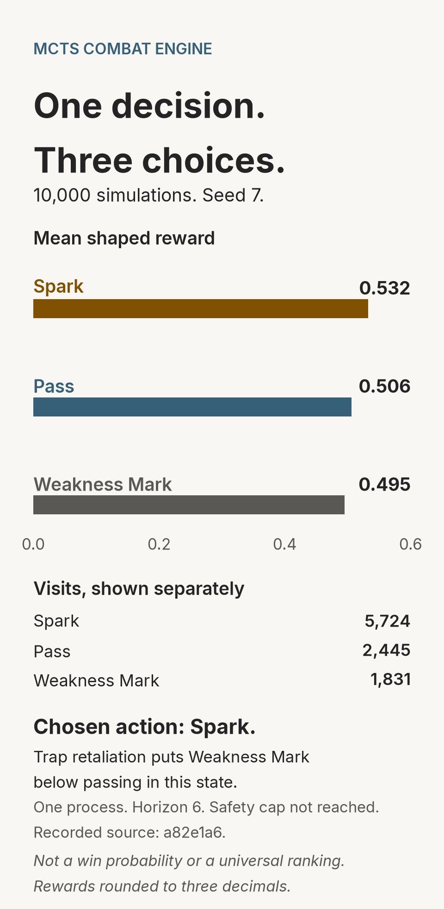

# MCTS Combat Engine

[](https://github.com/T92T1914/mcts-combat-engine/actions/workflows/ci.yml)


I built this to explore how a search chooses an action when the outcome can change. It uses Monte Carlo Tree Search in a small combat simulator, with three encounters and random and greedy policies to compare against. The engine is pure Python and has no runtime dependencies.

**Recorded fixed budget benchmark (September 6, 2026):** search wins 30/30 duels, 30/30 gauntlets and 15/30 boss encounters at 3,000 simulations per decision. Random wins 27, 17 and 8; greedy wins 11, 11 and 0. These are small samples from one search seed, not a general playing strength guarantee.

[Run it](#run-it) · [Results](#results) · [How it works](#how-it-works) · [Design decisions](docs/design-decisions.md)

[Explore the browser demo](https://t92t1914.github.io/mcts-combat-engine/) · [Open in Codespaces](https://codespaces.new/T92T1914/mcts-combat-engine)

Use **Link to this example** in the browser demo to share the selected result.
The URL keeps the example's visible label, and Back and Forward restore earlier
selections. These links inspect saved evidence; they do not run a new calculation.

The action inspector supports Auto, Clair and Obscur. Auto follows the system
appearance, while a saved choice stays local to this project. Switching keeps the
selected action, metrics and share link. The original recorded diagram and JSON
stay unchanged. Inter is used when installed locally, with a system-font fallback
for other visitors and no remote font download. Code keeps its monospace font.
The generated site's [presentation record](https://t92t1914.github.io/mcts-combat-engine/presentation.json)
separates the page revision from the source revision of the saved decision.

## Run it

Python 3.11+; no installation is needed to run the example or standard library tests from a checkout.

```sh
python demo.py boss --sims 10000
python benchmark.py 30 --sims 3000 --seed 42
python -m unittest discover -s tests
```

The demo's `--sims` selects a fixed simulation count with no clock limit.
An unchanged search seed, code and content reproduce its ranking table.
Elapsed time and simulations per second still vary. Without `--sims`, the demo
keeps its time budget. The episode benchmark has the separate safety caps
described below.

Install `pip install -e ".[dev]"` for development, then run `ruff check .` and `mypy`. CI tests Python 3.11, 3.12 and 3.13. `pip install .` installs the reusable `engine` package; `game`, `data` and the demonstration scripts remain separate examples.

The [complete companion](docs/episode-companion.md) supports custom recording,
replay, saved-state decisions and inspection with an installed engine and no
development checkout. Its [independent one-round reference](docs/episode-reference.md)
prices every supported physical action from a saved horizon-one decision,
reports exact expectations and selected-action score loss, and generates local
inspection/comparison pages. The probability law, model identity and cooperative
work limits are explicit. These values describe the declared one-round objective,
not full-encounter optimality or calibrated win probability. Engine packaging,
search defaults and the separate saved episode reader kit remain preserved.

### Save a comparison

```sh
python benchmark.py 30 --sims 3000 --seed 42 --json results.json --markdown results.md
```

The JSON file keeps the aggregate results, effective search budget, game seeds,
policy seeds, search seed and environment details. The Markdown file presents the same run as
a table. Both exports come from one set of results, so saving them does not rerun
the experiment. Output paths must be different and their parent folders must exist.

Policy choices use their own random stream. Extra random draws inside a policy
cannot change the environment's next outcome when the chosen actions stay the
same. Search starts fresh for each scenario, then continues across its games.
Reordering the scenarios therefore leaves fixed-budget results unchanged when
the safety cap is not reached. Different actions can still consume different
environment draws, so paired starting seeds do not mean identical later luck.

Use `--game-seed 10 --policy-seed 20` to choose the first environment and policy
seeds independently. Each game increments those seeds by one. JSON schema 3
records these ranges, the policy seed format, and the search stream's scope.
Each search result also contains `search_work.decision_simulations` and
`below_requested_simulations`. The Markdown export summarizes these observed
counts. A safety timeout is recorded as a shortfall, not a completed fixed budget.

Timed search uses unseeded search randomness and records `search_seed` as `null`.
With `--sims`, the recorded time limit is the 60 second safety cap, even if a
different positional time budget was supplied. The JSON contains aggregate
results, per-game outcome records and decision work counts. It does not contain
full state and action traces. Keep the source revision alongside an export when
comparing changes to the engine.

To give search and one-round enumeration the same allowance of simulated rounds:

```sh
python benchmark.py 5 --transitions 300 --game-seed 200 --seed 7 --policy-seed 7 --json transitions.json --markdown transitions.md
```

This serial mode adds the one-round comparator and counts every simulator call
used to evaluate actions. MCTS counts tree traversal, expansion and rollout.
It starts a simulation only when the remaining allowance can fund its full
five-round horizon. The comparator completes whole sweeps over every legal
action, using the same starting sample seed for each candidate in a sweep.
Neither method truncates its final work unit just to spend the allowance.

The export records actual transitions, unused allowance, completed simulations
or sweeps, and stop reasons for every decision. A 60 second safety cap is checked
between complete work units. A decision stopped early by that cap remains
incomplete. The same transition allowance is not equal CPU time, and different
remainders or game lengths can produce different total spending. Random and
greedy remain contextual controls that do no sampled forward search. This mode
uses descriptive results without confidence intervals or z statistics.

Choose `--transitions` separately from `--sims` and `--one-round-samples`.
Existing timed and fixed-simulation commands keep their behavior.

For reproducible parallel decisions, use
[`ParallelMCTS` with `mode="fixed"`](docs/parallel-fixed-work.md). It divides a
single simulation and optional transition allowance across workers, records
their seeds and actual work, and raises on incomplete worker results without
retrying the allowance. Time mode remains available. The episode benchmark and
its existing studies are unchanged. The separate
[process scaling protocol](docs/parallel-scaling-protocol.json) defines the new
computational comparison and was committed before its outcomes were collected.

### Reading one decision

<a href="docs/visual-example.md">
  <picture>
    <source media="(min-width: 1024px) and (prefers-color-scheme: dark)" srcset="docs/mcts-decision-obscur-wide.png">
    <source media="(min-width: 1024px) and (prefers-color-scheme: light)" srcset="docs/mcts-decision-clair-wide.png">
    <source media="(prefers-color-scheme: dark)" srcset="docs/mcts-decision-obscur.png">
    <source media="(prefers-color-scheme: light)" srcset="docs/mcts-decision-clair.png">
    
  </picture>
</a>

The search ranks three actions after 10,000 simulations. Its shaped reward describes this decision and is not a win probability. The example and its reproduction command are below.
[Reproduce and inspect the values](docs/visual-example.md).

The seeded 10,000 simulation boss demo produces:

```text
move                              reward    visits
Spark -> Frost Tyrant              0.532     5,724
Pass                               0.506     2,445
Weakness Mark -> Frost Tyrant      0.495     1,831

Recommended: Spark -> Frost Tyrant
```

The reward is a mean shaped value, **not a calibrated win probability**. The compatibility field `RankedAction.win_rate` retains its original name. The boss punishes traps, and the search ranks Weakness Mark below passing in this decision. Timing depends on the machine and its load; the seeded visit counts do not, provided the safety time cap is not reached.

## Results

30 games per policy per scenario, game seeds paired across policies; 3000 simulations per decision, search seed 42, horizon 5, 60 second safety cap, single process.
Python 3.11.8 on Windows 10-10.0.26200 SP0, 16 logical CPUs; AMD Ryzen 7 7800X3D; Windows 11; 64 GB RAM.
Run on 2026-09-06.

These recorded results predate the separate policy stream and per-scenario
search reset. They are retained as historical measurements. A new run uses the
repaired experiment protocol and should be reported separately.

| scenario | random | greedy | mcts (3000 sims) | search vs best baseline |
|---|---|---|---|---|
| duel | 90% (74 to 97) · 19.7r | 37% (22 to 54) · 16.9r | **100% (89 to 100) · 16.2r** | z = 1.78 vs random |
| gauntlet | 57% (39 to 73) · 24.2r | 37% (22 to 54) · 17.5r | **100% (89 to 100) · 17.2r** | z = 4.07 vs random |
| boss | 27% (14 to 44) · 25.0r | 0% (0 to 11) | **50% (33 to 67) · 22.5r** | z = 1.86 vs random |

*win % = clean wins (95% Wilson interval) · Nr = average rounds to win, when it won · bold = best in row*


[Full results and raw measurements](docs/benchmark-results.md) include a matched comparison against the pre repair engine. Fixing action identity changed search wins from **29 / 30 / 16** to **30 / 30 / 15** across the three encounters. The boss result decreased by one game. This is a correctness repair, with no claim of universal improvement.

The [historical wall clock results](docs/benchmark-results-historical.md) describe earlier code and are explicitly archived. For machine budget exploration, `python benchmark.py 60 120` still runs the timed benchmark. Wall clock runs can differ because their simulation counts differ.

The [one-round comparator study](docs/comparison-results.md) uses the repaired
random-stream protocol with three search and policy seed repeats over five
environment seeds per scenario. The comparator enumerates legal moves, including
healing and defense, and samples eight one-round outcomes for each. It won a duel
condition that MCTS did not finish within the 30-round limit. MCTS won more
gauntlet and boss games, while random beat
the comparator in two conditions. All game outcomes and actual work counts are
retained. The policies use unequal compute budgets, and the repeats do not become
15 independent trials.

```sh
python benchmark.py 5 --sims 300 --seed 7 --policy-seed 7 --one-round-samples 8 --json comparison.json
```

`--one-round-samples` adds the comparator without changing the default policy set.
JSON exports include per-game seeds, scores, terminal results and round counts,
alongside their aggregates. A successor transition and a MCTS simulation are
different work units, so the recorded counts do not establish efficiency.

Run one reference decision from the checkout:

```sh
python demo.py gauntlet --one-round-samples 8 --seed 7
```

This prints every sampled legal action, its zero-based hand and target indexes,
mean value and completed sample count. The fixed scenario seed is 7, while
`--seed` controls the sampling stream. The selected action follows the existing
policy's tie order. The command completes the requested samples without a clock
limit, and elapsed time is only an observation. Choose this mode separately from
`--sims`, `--budget-ms` and `--horizon`. Ordinary MCTS demo commands keep their
behavior. The values share the simulator and heuristic with the search. They
are not calibrated win probabilities or MCTS visit counts.

The same one-round reference values are available to a Python caller:

```python
import random
from game.baselines import one_round_decider
from game.content import SCENARIOS

state, _ = SCENARIOS["duel"](random.Random(7))
rankings = []
choose = one_round_decider(8, on_ranking=rankings.append)
action = choose(state, random.Random(7))
for row in rankings[-1]:
    print(row.action.describe(state), row.mean_value, row.samples, row.value_sum)
```

Each immutable row keeps its current hand index and target, completed sample
count and raw value sum. The tuple follows the policy's ranking and stable tie
break, so its first action is the chosen move. Higher values favor the player:
terminal wins score one, losses zero, and ongoing successors use the HP and
setup heuristic in `[0, 1]`. Descending raw sums break equal values by Pass first,
then ascending hand and target indexes. Every action has the same sample count,
so this also ranks their means. A transition allowance or time stop reports
only complete sweeps. A clock limit reached during a sweep lets every candidate
finish that sweep before stopping.
Terminal roots report an empty tuple. A time stop before any complete sweep
reports an empty tuple and still raises `ValueError`. An allowance too small for
one sweep raises before evaluation and emits no ranking. These sampled values
share the simulator and heuristic with MCTS. They are not independent ground
truth, calibrated win probabilities or confidence intervals. Collecting the
ranking with a passive callback adds no simulation or random draw, and does not
change existing exports or retained study results.

The separate [transition allowance study](docs/transition-comparison-results.md)
gives both methods 300 simulated rounds per decision on five new environment
seeds, repeated with search and policy bases 7, 42 and 99. MCTS won all five duels
and gauntlets in each repeat, with 4, 3 and 4 boss wins. The comparator won
3, 4 and 4 duels, 4, 5 and 4 gauntlets, and no boss games. Random beat it in two
duel conditions and one boss condition. All 180 game records, unfinished games,
actual work and unused allowances are retained. No decision hit its safety cap.
This matches transition allowances, not CPU time or total work across games.
The small repeated environment set still does not establish general superiority.

The new [fixed work process study](docs/parallel-scaling-results.md) measures
three initial states with three search seeds, 1, 2 and 4 workers, and both fresh
and reused process pools. All 54 searches spent exactly 12,000 simulations and
60,000 transitions. Every repeated pool pair preserved the worker seeds, root
statistics and rankings. Median paired wall time ratios versus one worker were
1.71 and 2.86 for two and four fresh workers, then 2.09 and 3.88 with reused pools.
These are observations on a shared machine, not a linear scaling guarantee.
Some selected targets changed when the number of independent trees changed.
No complete games or playing strength outcomes were measured in this study.

[Open the Clair and Obscur report](https://t92t1914.github.io/mcts-combat-engine/parallel-scaling.html)
to inspect every cell, startup and serialization controls, raw results and the
declared protocol. Its theme changes only the presentation of saved measurements.

The later [same forest execution control](docs/same-forest-results.md) runs the
same independent roots sequentially and in cold or initialized process pools.
All 18 executions spent their full allowances, and every computational receipt
and ranking matched within each of the six conditions. This holds the forest
fixed while comparing execution time. It does not compare decision quality or
treat different tree counts as the same search. Each mode was measured once.
The two root Boss warm execution took 0.794 seconds compared with 0.759 seconds
cold, and that unfavorable observation remains in the report. Warm preparation
is separate from its search timer.

[Read the Clair and Obscur execution report](https://t92t1914.github.io/mcts-combat-engine/same-forest.html)
for every timing, raw receipt, the declared protocol and the research that
informed this separate control after the earlier study was complete.

The [serial profiling investigation](docs/serial-profile-results.md) inspects
three fixed decisions without changing the engine. All six control and
instrumented searches completed the same work and matched their root statistics,
rankings and random generator states. Cost was spread across legal actions,
hashing, tree traversal and simulator operations. The bounded result did not
justify a native port, so the Python reference remains unchanged. The report
retains the full profile and the limits of that no-change decision.

## How it works

1. Clone the current state and replay an action sequence under fresh randomness.
2. Map tree edges to stable root hand slots. Removing a card cannot shift an edge onto another card; duplicate copies keep separate identities.
3. Recompute legal moves in each realized state. Expand newly available choices and select only available edges by UCB1. An unavailable edge receives no backup as if it were a pass.
4. Roll out to the configured horizon, score the result and back up the shaped reward.
5. Rank root actions by mean reward, with visit count as a tie break. Optional independent worker processes merge visit counts and value sums.

The simulator also validates externally supplied moves. Invalid targets, unaffordable cards and out of range indexes become a pass without consuming a card. Search correctness does not rely on that fallback: an instrumented regression checks that every search generated move is legal.

Open loop nodes store action sequences rather than full chance trees. Their values average sampled outcomes, conditional on an edge being available. The example supplies the current state; this is stochastic planning, not an information set search over hidden opponent hands.

Terminal wins receive a depth discount; losses have a small survival component. Unfinished rollouts use an HP heuristic that credits setup. Those choices help a shallow search value healing, blades and traps, but were not subjected to a parameter sweep. Selection and rollout both stop at the configured horizon.

An optional opening book supplies `{card_name: (count, mean_reward)}` priors.
Counts must be nonnegative integers and rewards finite numbers between zero and
one. JSON list pairs also work. Zero observations add no evidence; positive
counts contribute three virtual visits per observation, capped at 30 per action.
The whole book is validated before sampling or starting worker processes, so a
corrupt entry raises `ValueError` instead of contaminating the rankings. Virtual
visits are included in action visits but not in `last_sims`. Each parallel worker
uses its own copy of the prior, just as it builds its own tree.

## Code tour

| Start here | What to inspect |
|---|---|
| [engine/mcts.py](engine/mcts.py) | Stable action mapping, available edge selection, expansion and backup |
| [engine/actions.py](engine/actions.py) | Enumeration and validation share legality rules |
| [engine/simulator.py](engine/simulator.py) | One stochastic round and invalid input handling |
| [engine/parallel.py](engine/parallel.py) | Independent worker searches and aggregation of visits and value sums |
| [game/loader.py](game/loader.py) | Validated JSON content; the engine never imports the game |
| [tests/test_action_identity.py](tests/test_action_identity.py) | Regressions for shifted cards, duplicate copies, target changes and horizon bounds |
| [Design decisions](docs/design-decisions.md) | Tradeoffs and alternatives tied to implementation |

## What these numbers do not prove

* Thirty games per cell and one search seed leave substantial sampling uncertainty. Shared starting seeds do not remove it. The z scores in the generated table are descriptive approximations, not a paired significance analysis.
* Random and greedy are simple baselines. Greedy never heals, while random sometimes does. The newer one-round comparator covers every legal action but still shares the simulator and heuristic with the search. The bounded studies include new environment seeds and matched transition allowances, but do not establish general superiority or equal CPU cost.
* The engine is separated from the example game, but broader generality has not been demonstrated on a second domain.
* Parallel merging is tested, and a separate bounded study now measures process
  scaling on three initial states. It does not establish linear scaling, full
  game throughput or playing strength. Compilation speedups remain unmeasured.
* The `mcts_decider` wrapper supports `seed`, `max_sims` and `max_transitions`
  only in serial mode. With `parallel=True` it uses a time budget and rejects
  these controls, including
  with `workers=1`. Passing an unsupported control cannot silently become a
  different experiment.
* Mean reward ranking can favor a lightly visited lucky action. Visits are shown so the uncertainty is visible.

## License

MIT. See [LICENSE](LICENSE).

## Questions and contributions

Found a problem or have a useful comparison? [Open an issue](https://github.com/T92T1914/mcts-combat-engine/issues) with a small example I can run. The [contribution guide](CONTRIBUTING.md) covers setup, checks and the evidence to include with a change.

## Engineering skills in this project

I built this to understand how software compares uncertain outcomes under a limited compute budget. The useful part for me is being able to trace a choice back to its samples, its assumptions and the benchmark that tested it.

- **Search algorithms.** Follow selection, expansion and rollout through one implementation. [Inspect the work](engine/mcts.py).
- **Parallel work.** Read why work is divided between independent search roots and how results are combined. [Inspect the work](docs/design-decisions.md).
- **Fair comparisons.** Compare recorded search results under stated seeds and budgets, including the weaker result. [Inspect the work](docs/benchmark-results.md).

This demonstrates algorithm and experiment design. Applying it to routing or scheduling would need a new domain model, constraints and validation; the current project does not claim that deployment.

See [sharing previews](docs/sharing-preview.md) for the maintained link image and its source.
