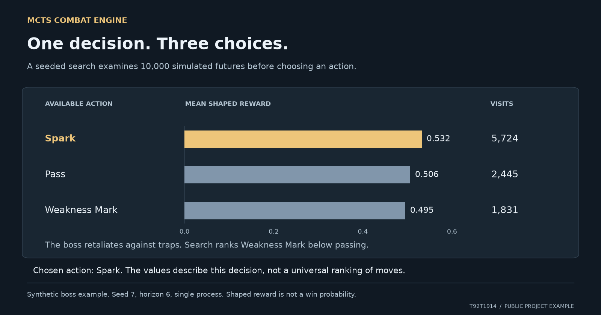

# Read the visual example



The search ranks three actions after 10,000 simulations. Its shaped reward describes this decision and is not a win probability. The example and its reproduction command are below.

## Reproduce the values

Run from this repository using its documented Python environment.
Evidence was checked against commit `a82e1a6`.

```sh
python demo.py boss --sims 10000 --seed 7 --horizon 6
```

The public synthetic boss scenario starts from the demo's fixed deal seed 7.
The search also uses seed 7 and a horizon of six. The safety time cap was not
reached. Reward values in the image use the three decimal places printed by
the demo; visit counts are exact. The reward axis begins at zero and is not
a probability axis. No confidence interval is inferred from those visits.

The boss retaliates when a trap is cast. Weakness Mark is therefore ranked
below passing in this particular state. This is not a universal move ranking.
The separate [paired benchmark](benchmark-results.md) shows the full scenario
comparison, including the boss result that decreased by one game after a
correctness repair.

## Inspect the source

The [underlying values](visual-example-data.json) include the source and
conditions. A [vector copy](mcts-decision-example.svg) is available for a closer look.
The figure is a visual explanation of the public implementation, not a
screenshot of an external application.
